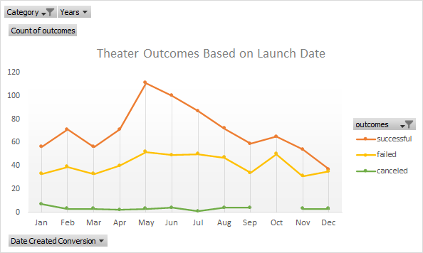
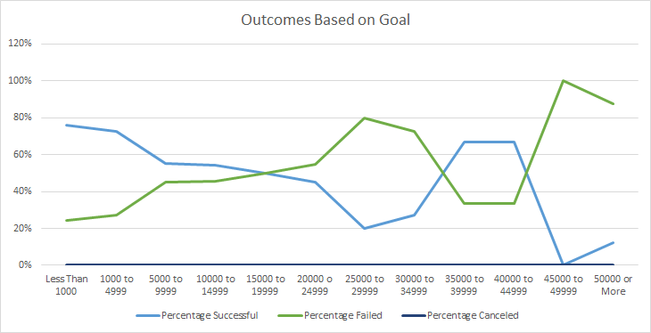

# **Kickstarting with Excel**

## **Overview of Project**

Louise's play *Fever* came close to it's fundraising goals, she would now like to know how other campagins performed in relation to hers.

### Purpose

The purpose of this challenge is to visualize different campaign outcomes based on their launch date and funding goals. 

This will provide Louise with more information on the length of a campaign required in order to maximize funding goals. This will also provide a realistic goal to maximize funds.

## Analysis and Challenges

### Analysis of Outcomes Based on Launch Date

This analysis looks at the outcome of successful, failed, and canceled fundraisers for the parent category, *Theater*. 

In order to determine the outcomes, a pivot table was created to easily view the outcome for each month. I first created a new column labelled *Years* and used the =Year() function to determine the year the campaign had started. Then I selected the whole table and created a new Pivot table. Within the pivot table fields both Category and Years were filtered out. Then I used the Date Created Conversion field in the rows to determine the outcome by months. Finally, I used the outcomes field in Columns and Values to determine the count of outcomes. 
The last step for the pivot table was to filter out the category for Theater. 

In order to visualize this data, I used the *PivotChart* tool in excel to visualize the data by a line graph. In the x-axis are the months, and the y-axis displays the total amount for each of the outcomes.

### Analysis of Outcomes Based on Goals

This analysis evaluates the percentage of successful, failed, and canceled projects in the *plays* subcategry for goals broken up into different ranges. 

To determine the number of successful, failed and canceled shows, the COUNTIFS() Function was used. The function filters out by Kickstarter "outcome" column, "goal" column using ranges created previously, and "subcategory" column using *plays* as the criteria. 

The Sum() function was just to populate the "Total Projects" column for each outcome. Then the percentage was calculated by dividing each outcome from the "Total Projects" column. 

Finally, a line chart was created for the Outcomes to visualize the relationship between the percentage successful, failed, cancelled on the y-axis, and the range for each goal in the x-axis. 

### Challenges and Difficulties Encountered

For the Analysis on *Outcomes based on launch date*, one part of this step I found difficult was creating the Months in the rows area. At first I was dragging down Years, but it would just remove it from the filter and not give me an option to add months. I went back to the module 1 challenge hint, and reading the tip gave me an idea to instead move the *Date Created Conversion* down to rows. From there I filtered out for months, and thus was successful in achieving outcomes by Months. 

For the Analysis on *Outcomes based on Goals*, a difficult part was creating the COUNTIFS() function. I used both the outcomes and goal range as criteria, and instead of adding another criteria for subcategory *plays* here, I went back to the Kickstarter spreadsheet and filtered it out instead. I noticed right away the results were wrong since the graph was different from the results and there were no cancelled shows under *plays*. I went back and removed the filter in the original sheet, then added the additional criteria for *plays*, and voila, the chart results were corrected. 

## Results

- What are two conclusions you can draw about the Outcomes based on Launch Date?

    1. Between the months of April and July, there were more successful plays as opposed to failed. The gap was much larger, almost double for the number of successful plays. 
    2. In the month of October there were no cancelled shows, however there were more failed shows tha the previous months. 
    3. Based on this analysis, the best month to launch a fundraiser is between May and June. 

- What can you conclude about the Outcomes based on Goals?

    * Plays that were successful had funraiser goals that were below $15,000
    * Outliers exist however for ranges between $35,000-$44,999, results for successful plays
    * Recommendation to set a goal below $5000 in order to avoid a higher chance of a failed funraiser. 

- What are some limitations of this dataset?

    * Outliers with higher goals weighing the distribution
    * Many external factors could influence the dataset
    * Dataset does not filter for countries
    * Currency is different for every play, does not give accurate data for Outcomes by goals
    * Number of backers

- What are some other possible tables and/or graphs that we could create?

    * Box and Whisker chart: Shows the number of outliers and the range in which plays were successful or failed
    * Filter table for goals by country and currency or convert the currency to compare between different countries using a single currency. Compare against success.
    * Line graph showing number of backers against total pledged amount to show realistic amount that can be used as goal

